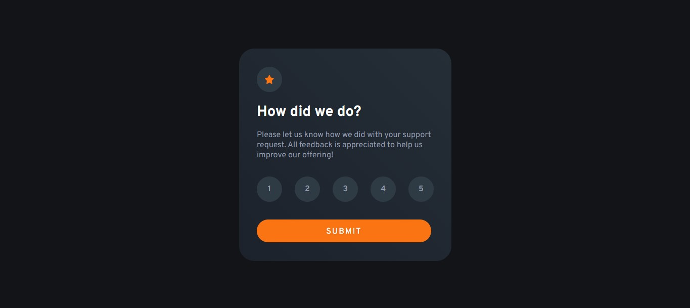
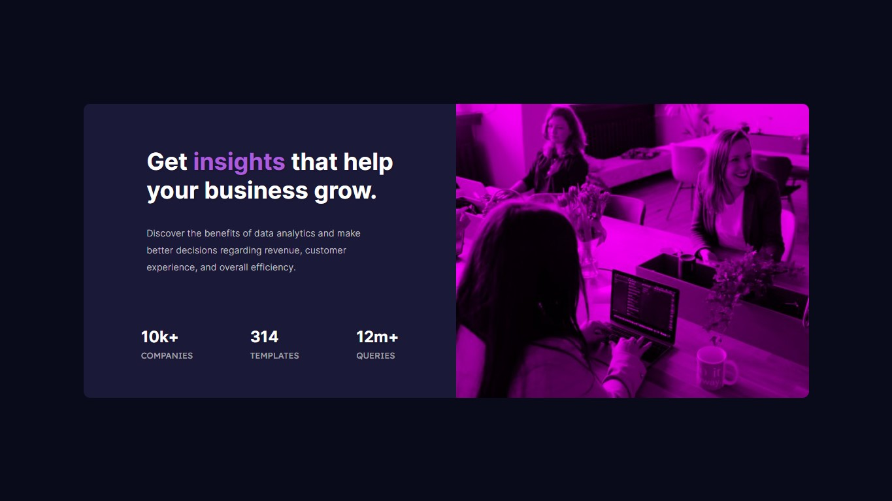

# Challenges From Frontend Mentor 

- [Frontend Mentor](https://www.frontendmentor.io/profile/lucaspicinini) challenges help you improve your coding skills by building realistic projects. 

### Live Sites

- [Interactive Rating Component Main](https://lucaspicinini.github.io/front-end-mentor-challenges/interactive-rating-component-main/)

- [Results Summary Component Main](https://lucaspicinini.github.io/front-end-mentor-challenges/results-summary-component-main/)

- [Stats Preview Card Component Main](https://lucaspicinini.github.io/front-end-mentor-challenges/stats-preview-card-component-main/)

