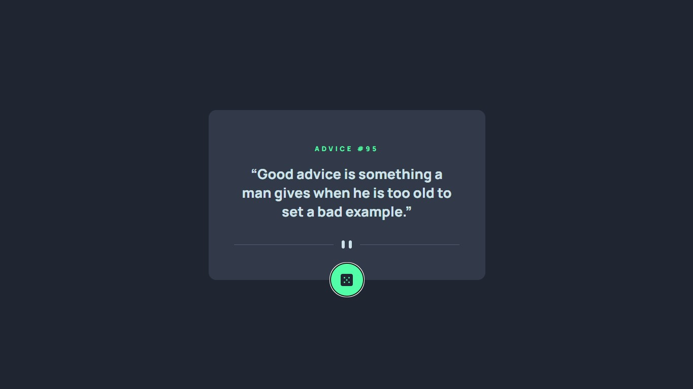
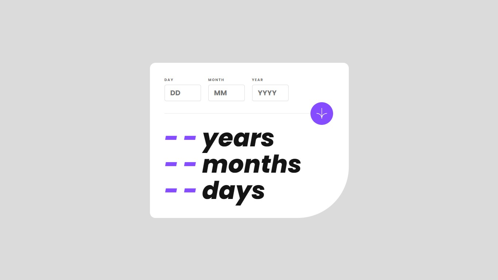
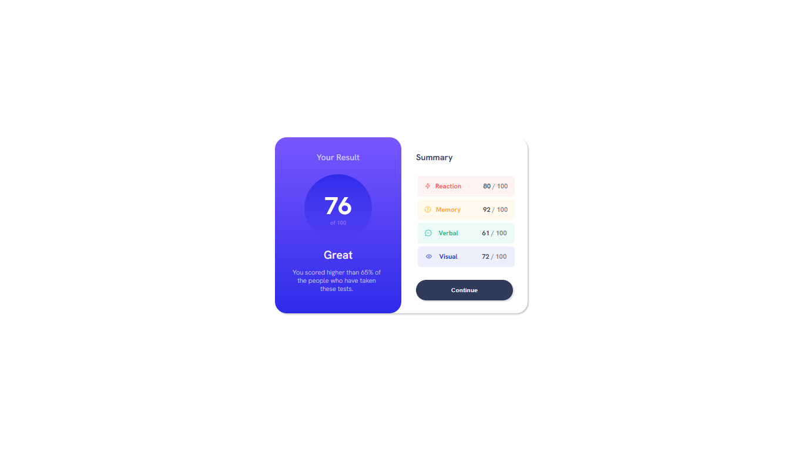

# Challenges From Frontend Mentor 

- [Frontend Mentor](https://www.frontendmentor.io/profile/lucaspicinini) challenges help you improve your coding skills by building realistic projects. 

### Live Sites

- [Advice Generator App](https://lucaspicinini.github.io/front-end-mentor-challenges/advice-generator-app-main/)

- [Newsletter Sign Up](https://lucaspicinini.github.io/front-end-mentor-challenges/newsletter-sign-up-with-success-message-main/)

- [Age calculator app](https://lucaspicinini.github.io/front-end-mentor-challenges/age-calculator-app-main/)

- [Article Preview Component Master](https://lucaspicinini.github.io/front-end-mentor-challenges/article-preview-component-master/)

- [Interactive Rating Component Main](https://lucaspicinini.github.io/front-end-mentor-challenges/interactive-rating-component-main/)

- [Results Summary Component Main](https://lucaspicinini.github.io/front-end-mentor-challenges/results-summary-component-main/)

- [Stats Preview Card Component Main](https://lucaspicinini.github.io/front-end-mentor-challenges/stats-preview-card-component-main/)

