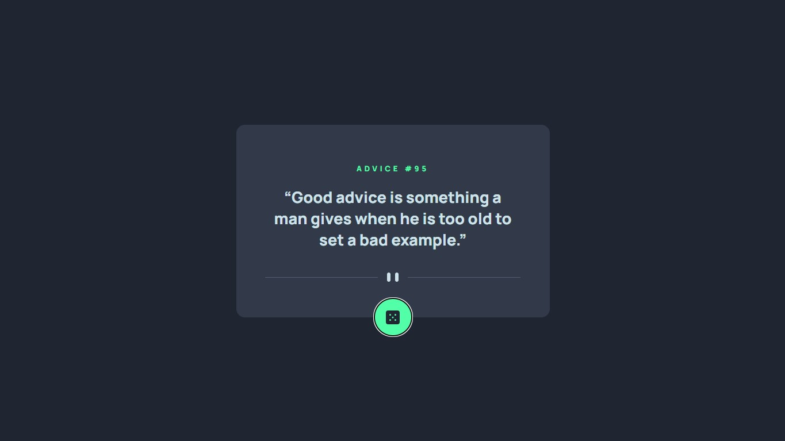

# Frontend Mentor - Advice generator app

This is a solution to the [Design preview for the Advice generator app coding challenge](https://www.frontendmentor.io/challenges/advice-generator-app-QdUG-13db)

## Table of contents

  - [The challenge](#the-challenge)
  - [Links](#links)
  - [Screenshot](#screenshot)
  - [Built with](#built-with)
- [Author](#author)

## The challenge

Your challenge is to build out this advice generator app using the [Advice Slip API](https://api.adviceslip.com) and get it looking as close to the design as possible.

You can use any tools you like to help you complete the challenge. So if you've got something you'd like to practice, feel free to give it a go.

Your users should be able to:

- View the optimal layout for the app depending on their device's screen size
- See hover states for all interactive elements on the page
- Generate a new piece of advice by clicking the dice icon

### Links

- Solution URL: [Solution](https://www.frontendmentor.io/solutions/using-an-api-for-the-first-time-pWrtqCH3ti)
- Live Site URL: [Live Site](https://lucaspicinini.github.io/front-end-mentor-challenges/advice-generator-app-main)

### Screenshot

### Built with

- Semantic HTML5 markup
- BEM methodology in the construction of CSS.
- JavaScript

## Author

- Frontend Mentor - [@lucaspicinini](https://www.frontendmentor.io/profile/lucaspicinini)
