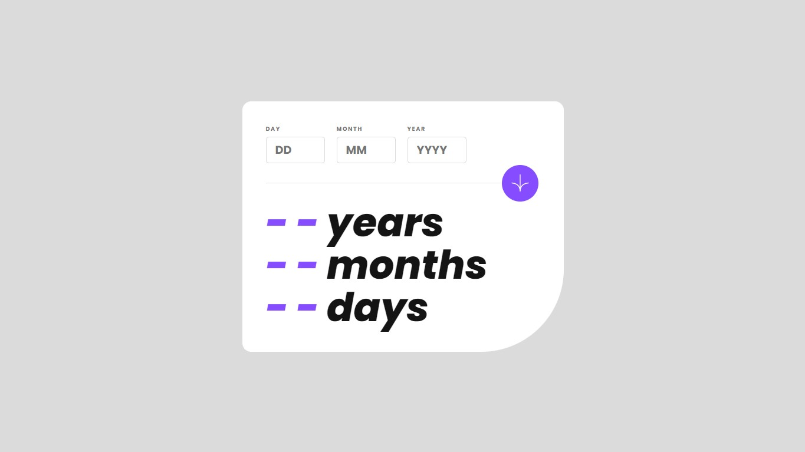

# Frontend Mentor - Age calculator app

This is a solution to the [Design preview for the Age calculator app coding challenge](https://www.frontendmentor.io/challenges/age-calculator-app-dF9DFFpj-Q)

## Table of contents

  - [The challenge](#the-challenge)
  - [Links](#links)
  - [Screenshot](#screenshot)
  - [Built with](#built-with)
- [Author](#author)

## The challenge

Your challenge is to build out this age calculator app and get it looking as close to the design as possible.

You can use any tools you like to help you complete the challenge. So if you've got something you'd like to practice, feel free to give it a go.

Your users should be able to: 

- View an age in years, months, and days after submitting a valid date through the form
- Receive validation errors if:
  - Any field is empty when the form is submitted
  - The day number is not between 1-31
  - The month number is not between 1-12
  - The year is in the future
  - The date is invalid e.g. 31/04/1991 (there are 30 days in April)
- View the optimal layout for the interface depending on their device's screen size
- See hover and focus states for all interactive elements on the page

### Links

- Solution URL: [Solution](https://www.frontendmentor.io/solutions/article-preview-component-master-html-css-and-javascript-O9RECo-9C1)
- Live Site URL: [Live Site](https://lucaspicinini.github.io/front-end-mentor-challenges/article-preview-component-master/)

### Screenshot

### Built with

- Semantic HTML5 markup
- BEM methodology in the construction of CSS.
- JavaScript

## Author

- Frontend Mentor - [@lucaspicinini](https://www.frontendmentor.io/profile/lucaspicinini)
