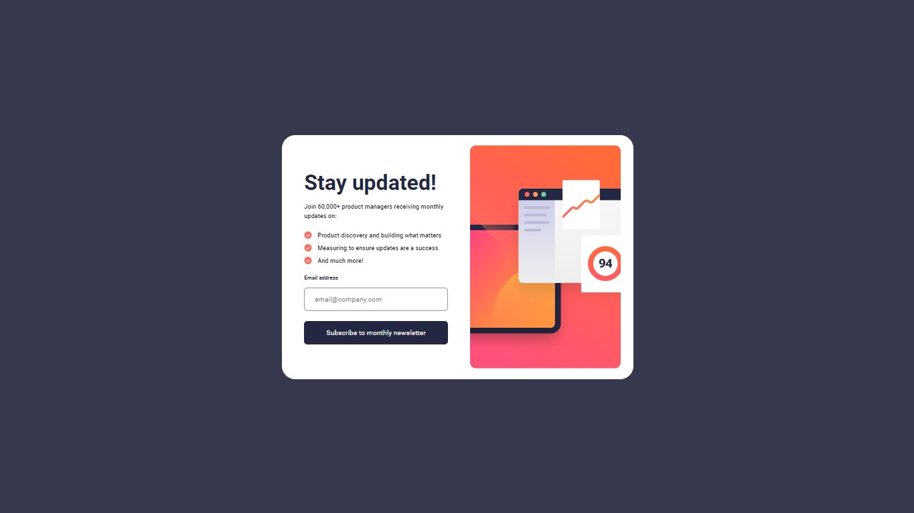

# Frontend Mentor - Newsletter sign-up form with success message solution

This is a solution to the [Newsletter sign-up form with success message challenge on Frontend Mentor](https://www.frontendmentor.io/challenges/newsletter-signup-form-with-success-message-3FC1AZbNrv).

## Table of contents

  - [The challenge](#the-challenge)
  - [Links](#links)
  - [Screenshot](#screenshot)
  - [Built with](#built-with)
- [Author](#author)

## Overview

### The challenge

Users should be able to:

- Add their email and submit the form
- See a success message with their email after successfully submitting the form
- See form validation messages if:
  - The field is left empty
  - The email address is not formatted correctly
- View the optimal layout for the interface depending on their device's screen size
- See hover and focus states for all interactive elements on the page

### Links

- Solution URL: [Solution](https://www.frontendmentor.io/solutions/responsive-newsletter-sign-up-with-css-and-js-lHjp4Dqxe8)
- Live Site URL: [Live Site](https://lucaspicinini.github.io/front-end-mentor-challenges/newsletter-sign-up-with-success-message-main/)

### Screenshot

### Built with

- Semantic HTML5 markup
- BEM methodology in the construction of CSS.
- JavaScript

## Author

- Frontend Mentor - [@lucaspicinini](https://www.frontendmentor.io/profile/lucaspicinini)
