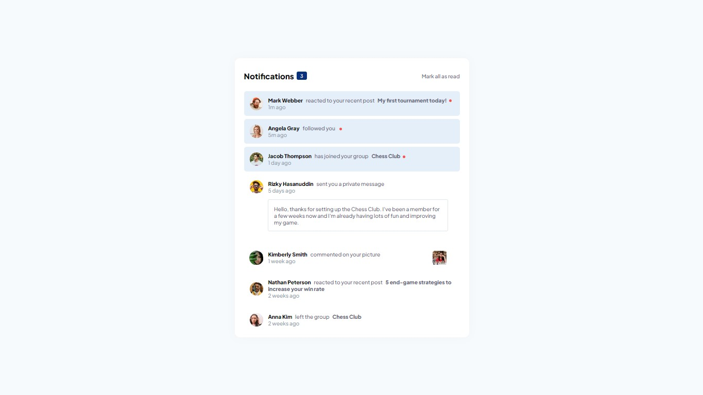

# Frontend Mentor - Notifications page solution

This is a solution to the [Notifications page challenge on Frontend Mentor](https://www.frontendmentor.io/challenges/notifications-page-DqK5QAmKbC).

## Table of contents

  - [The challenge](#the-challenge)
  - [Links](#links)
  - [Screenshot](#screenshot)
  - [Built with](#built-with)
- [Author](#author)

### The challenge

Users should be able to:

- Distinguish between "unread" and "read" notifications
- Select "Mark all as read" to toggle the visual state of the unread notifications and set the number of unread messages to zero
- View the optimal layout for the interface depending on their device's screen size
- See hover and focus states for all interactive elements on the page

### Links

- Solution URL: [Solution](https://www.frontendmentor.io/solutions/responsive-newsletter-sign-up-with-css-and-js-lHjp4Dqxe8)
- Live Site URL: [Live Site](https://lucaspicinini.github.io/front-end-mentor-challenges/newsletter-sign-up-with-success-message-main/)

### Screenshot

### Built with

- Semantic HTML5 markup
- BEM methodology in the construction of CSS.
- JavaScript

## Author

- Frontend Mentor - [@lucaspicinini](https://www.frontendmentor.io/profile/lucaspicinini)
