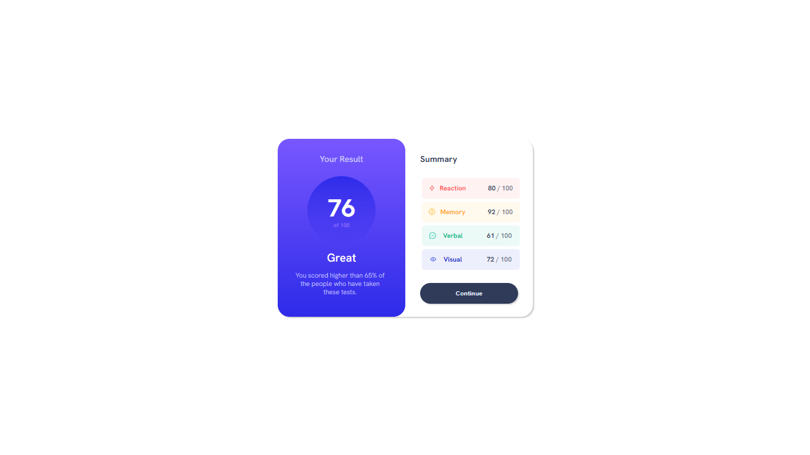

# Frontend Mentor - Results summary component solution

This is a solution to the [Results summary component challenge on Frontend Mentor](https://www.frontendmentor.io/challenges/results-summary-component-CE_K6s0maV). Frontend Mentor challenges help you improve your coding skills by building realistic projects. 

## Table of contents

  - [The challenge](#the-challenge)
  - [Links](#links)
  - [Screenshot](#screenshot)
  - [Built with](#built-with)
  - [What I learned](#what-i-learned)
  - [Continued development](#continued-development)
  - [Useful resources](#useful-resources)
- [Author](#author)

### The challenge

Users should be able to:

- View the optimal layout for the interface depending on their device's screen size
- See hover and focus states for all interactive elements on the page

### Links

- Solution URL: [Add solution URL here](https://your-solution-url.com)
- Live Site URL: [Add live site URL here](https://lucaspicinini.github.io/front-end-mentor-challenges/results-summary-component-main/index.html)

### Screenshot

### Built with

- Semantic HTML5 markup
- CSS Flexbox
- CSS Media Query
- BEM methodology in the construction of CSS. 

### What I learned

I started learning web development just 1 month ago, so keep in mind that I'm quite a beginner. I'm focusing on learning the basics and I tried to apply the BEM methodology in the construction of CSS, it seemed the simplest to apply for a beginner and I hope it turned out good. If you are more experienced and have any tips to give me, don't hesitate to send me a message, I love to learn.

### Continued development

I intend to train the markup languages until I feel minimally confident in doing something by myself and then I'll start learning JavaScript. I'm Brazilian and I've always been passionate about computing, but I only had access to the internet at friends or relatives' houses, I only had the opportunity to have my own computer and time to learn coding this year. I'm 31 years old and now I can finally follow this dream of working with programming.

### Useful resources

I am self-taught and I learn most things through W3Schools or freecodecamp.org

- [W3Schools](https://www.w3schools.com/)
- [freecodecamp.org](https://www.freecodecamp.org/)

## Author

- Frontend Mentor - [@lucaspicinini](https://www.frontendmentor.io/profile/lucaspicinini)