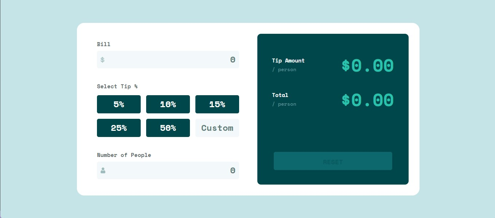

# Frontend Mentor - Tip calculator app solution

This is a solution to the [Tip calculator app challenge on Frontend Mentor](https://www.frontendmentor.io/challenges/tip-calculator-app-ugJNGbJUX).

## Table of contents

  - [The challenge](#the-challenge)
  - [Links](#links)
  - [Screenshot](#screenshot)
  - [Built with](#built-with)
- [Author](#author)

### The challenge

Users should be able to:

- View the optimal layout for the app depending on their device's screen size
- See hover states for all interactive elements on the page
- Calculate the correct tip and total cost of the bill per person

### Links

- Solution URL: [Solution](https://www.frontendmentor.io/solutions/notification-page-with-css-and-js-VuCakYwKfb)
- Live Site URL: [Live Site](https://lucaspicinini.github.io/front-end-mentor-challenges/tip-calculator-app-main/)

### Screenshot

### Built with

- Semantic HTML5 markup
- Flexbox
- CSS Grid
- JavaScript

## Author

- Frontend Mentor - [@lucaspicinini](https://www.frontendmentor.io/profile/lucaspicinini)
